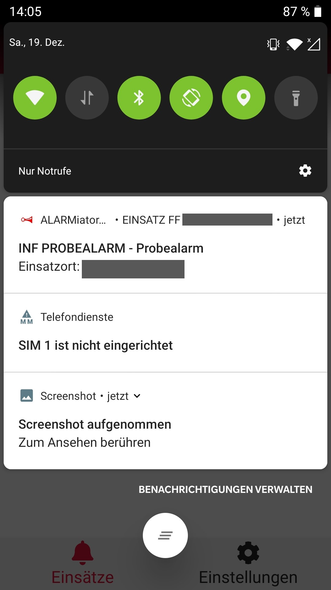

# Generell

ALARMiator-Mobile ist eine APP zur Zusatzalarmierung für Feuerwehren und THW. Diese APP ist für das Smartphone der Hilfskraft gedacht und arbeitet ausschließlich mit einer ALARMiator-Server-Instanz. 

# Alpha-Betrieb

Um die APP installieren zu können, muss die E-Mail-Adresse des Google-Kontos oder des Apple-Kontos, dass auf dem Smartphone oder dem Tablet verwendet wird, an die Entwickler gemeldet werden.

> ## 1. Android
> Nach Freischaltung erhält man einen Link, um die APP aus dem PlayStore zu installieren. 
> Alle weiteren Updates werden wie gewohnt in der Google-Play-APP angezeigt und können von dort installiert werden.

> ## 2. iOS
> Nach Freischaltung erhält man von Apple eine Mail mit den Anweisungen. Die TestFlight APP aus dem AppStore muss installiert werden.
> Hier kann nun die ALARMiator-Mobile APP installiert werden.

# Grundeinstellungen vor dem ersten Start der APP

> ## 1. Android
> Bei Android Geräten sollte vor dem ersten Start in den APP-Details der ALARMiator-Mobile-APP die AKKU-Optimierung deaktiviert werden und die Hintergrund-Datennutzung aktiviert werden. 

> ## 2. iOS
> ?

# Anmelden der APP an einer ALARMiator-Server-Instanz
### 1. Starten Sie die APP

### 2. Bestätigen Sie die Anfrage nach dem Speicher und Medien-zugriff.

### 3. Sie befinden Sich nun am Haupt-Bildschirm der APP

Drücken sie hier auf das Icon in der rechten oberen Ecke, um zu den Benutzerprofilen zu gelangen.

### 4. Über das Icon in der rechten oberen Ecke gelangen Sie nun zum Login an einem ALARMiator-Server.

Hier benötigen sie nun das Dokument mit ihren Zugangsdaten, dass Sie von ihrem ALARMiator-Server-Administrator erhalten haben.
Nutzen Sie den "QR-Code Scanner"-Knopf um den Code von diesem Dokument zu scannen.
Die Daten des QR-Codes werden automatisch in die Felder übernommen.

Bestätigen Sie nun mit dem "Einloggen"-Knopf.

### 5. Ändern Sie ihr Passwort
Ändern Sie das Passwort und notieren Sie es sich. Sollten Sie ein neues Smartphone bekommen, können Sie diesen Zugang mit dem geänderten Passwort weiter verwenden.

### 6. Melden Sie sich mit ihrem neuen Passwort am ALARMiator-Server an
Scannen Sie den QR-Code erneut und geben Sie im Passwort-Feld das neue Passwort ein.
Bestätigen Sie den Vorgang bitte anschließend mit dem "Einloggen"-Knopf.

Ihr Smartphone oder Tablet wurde nun am Server registriert. Ihr Server-Administrator wird darüber benachrichtigt.
Sobald ihr Server-Administrator das Gerät für die Alarmierung aktiviert hat, werden sie bei einem Einsatz ihrer Organisation über die APP benachrichtigt.

### Bilder einer Alarmierung:

